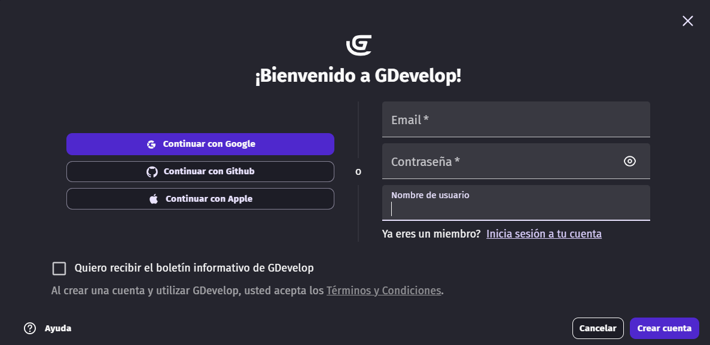
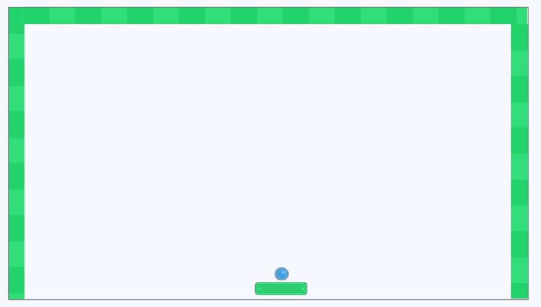
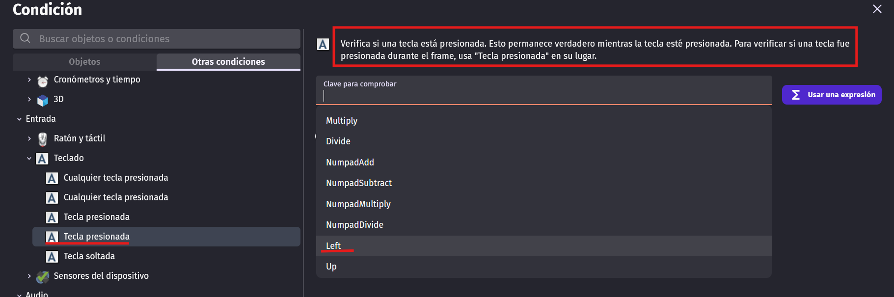
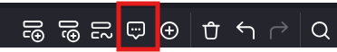
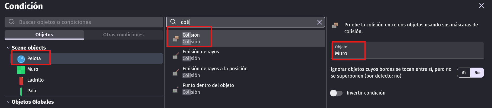
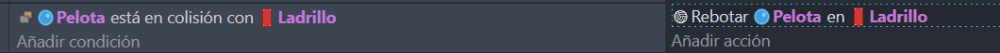
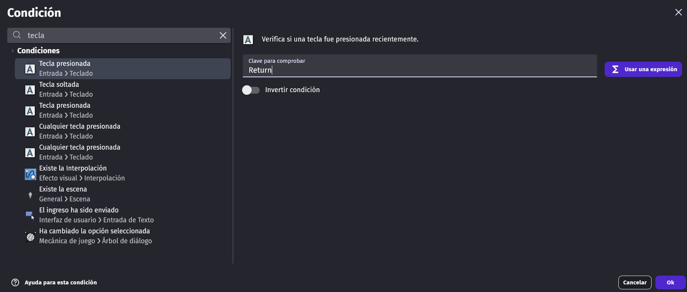

# Arkanoid en 90 minutos

!!! advise ""
    **CONTENIDO BASADO EN EL TUTORIAL OFICIAL DE GDEVELOP: [ARKANOID TUTORIAL](https://wiki.gdevelop.io/gdevelop5/tutorials/breakout/)**

**GDevelop** es un motor de creación de videojuegos **gratuito y de código abierto** que permite desarrollar juegos **sin necesidad de programar**. En lugar de escribir código, utiliza un sistema visual basado en **eventos** (condiciones y acciones) que hace que crear videojuegos sea accesible para cualquier persona, incluso sin experiencia previa.

**Características principales:**

- **Sin código:** Todo se hace mediante eventos visuales del tipo "Si pasa esto... entonces haz esto".
- **Multiplataforma:** Los juegos se pueden exportar a Windows, Mac, Linux, Android, iOS y Web (HTML5).
- **Asset Store integrado:** Miles de recursos gratuitos (personajes, objetos, sonidos) listos para usar.
- **Comportamientos predefinidos:** Física, plataformas, movimiento top-down, etc., ya programados y listos para aplicar.
- **Comunidad activa:** Tutoriales, ejemplos y foros donde resolver dudas.

**Ideal para e**studiantes que quieren crear sus primeros juegos.

Para acceder a la plataforma, haz clic en el siguiente enlace ([GDevelop](https://gdevelop.io/es-es))

## 1. Registro en la plataforma y preparación del entorno

Vamos a utilizar la aplicación web. Para ello, pulsamos sobre la opción “**Pruebalo**” en la parte superior derecha de la página y después “Lanzar”. Nuevamente, en la parte superior, tienes el botón “**Regístrate**”

{ .center width="60%" }

Utiliza las credenciales de tu identidad digital (…@alu.edu.gva.es)

Una vez registrados procedemos a crear un nuevo juego. Pulsa sobre el botón correspondiente, tal y como se indica en la imagen.

{ .center width="60%" }

Disponemos de varias plantillas para crear nuestro juego, en nuestro caso empezamos con “**Proyecto vacío**”.

{ .center width="60%" }

Por último, hay que indicar los últimos parámetros de configuración de nuestro juego. Resolución “**Paisaje de escritorio y móvil**”, Nombre del proyecto, **Arkanoid** o cualquier otro nombre que quieras ponerle. Donde almacenar este proyecto, **Nube de GDevelop** y por último, activar “**Optimizar para Pixel Art**”

{ .center width="60%" }

## 2. Preparación de Objetos

No dibujaremos nada. Iremos al **Añadir objketo** (parte derecha de la pantalla) y buscaremos elementos básicos; **Pelota**, **Pala**, **Ladrillo** y **Muros**.

!!! task "Añadir objetos" 

    En el paquete gratuito "***Rolling Ball Assets***" tenéis todos los objetos necesarios para el juego. Para acceder a este paquete, haz clic en "*Añadir objeto*" > "Buscar en la "*Tienda de Recursos*" y busca "Rolling Ball Assets". Luego, selecciona los objetos que necesitas (pelota, pala, ladrillos) y añádelos a tu proyecto.

    **Recuerda guardar tu proyecto para evitar perder tu progreso.**

## 3. Organización de objetos

!!! task "Añadir *Paleta* y *Pelota* a la escena"

    Para añadir un objeto a la escena, simplemente arrástralo desde la lista de objetos (en la parte derecha de la pantalla). 

    - Añade la pala y la pelota a la escena.  
      No te preocupes si la pelota es muy grande o la pelota está mal orientada, la podemos modificar. Selecciona el objeto y en la parte izquierda de la pantalla, en el panel de propiedades, puedes ajustar tanto el tamaño como la orientación de los objetos. Para **la pelota**, ajusta el tamaño a **32x32 píxeles**. Para la pala, asegúrate de que esté orientada horizontalmente y ajusta su tamaño según tus preferencias para que se vea bien en la escena, en mi caso, **la pala mide 128x32 píxeles**.
    
    - Sitúa la pala en la parte inferior de la escena, centrada horizontalmente. La pelota debe estar justo encima de la pala, lista para ser lanzada.
  
    **Recuerda guardar tu proyecto para evitar perder tu progreso.**

!!! task "Añadir *Muros*"

    Para crear el muro, deberás agregar tres instanciaas del objeto "*Muro*" a la escena. El muro se colocará a lo largo de los bordes izquierdo, derecho y superior de la escena para evitar que la pelota salga. En mi caso,**el muro mide 42x42 píxeles**, por lo que necesitarás varias instancias para cubrir toda la longitud de los bordes. Asegúrate de colocar las instancias del muro de manera que no haya espacios entre ellas, creando una barrera continua.

    El resultado sería algo parecido a esto:

    { .center width="50%" }

    **Recuerda guardar tu proyecto para evitar perder tu progreso.**

**No coloques todavía Los ladrillos.**

## 4. Movimiento de la pala

El jugador controlará la paleta usando las flechas izquierda y derecha en el teclado. Puede crear estos controles usando *eventos* (acciones que ocurren si las condiciones son verdaderas).

!!! task "Movimiento de la pala a la izquierda"

    Vamos a crear un evento en el que si el jugador presiona la flecha izquierda en el teclado, la pala se moverá hacia la izquierda. Para ello, sigue estos pasos:

    - Haz clic en la pestaña de *"Escena sin título (**Eventos**)"* en la parte superior de la pantalla.
    - Pulsamos sobre el botón "***Añadir un evento***"

    { .center width="50%" }

    - Selecciona la pestaña "*Otras condiciones*", y busca el evento "*Tecla presiona*". OJO, hay dos eventos con el mismo nombre, asgurate de seleccionar el que corresponde al que corresponde "*Verifica si una tecla está presionada*", tal y como se muestra en la imagen. En el apartado de "*Clave para comprobar*", pulsa sobre el botón seleccionar y elige la flecha izquierda.

    { .center width="50%" }

    !!! tip "Ángulos de movimiento" 

        Para mover objetos, tenemos que especificar un ángulo. La imagen de abajo ilustra como GDevelop entiende el ángulo de movimiento.

        { .center width="20%" }

    - Pulsa en el lado derecho del evento, sobre "***Añadir acción***".

    - Selecciona el objeto "***Pala***" y luego elige la acción "***Agregar una fuerza (ángulo)***". Configura la acción tal y como se muestra en la imagen.

    { .center width="50%" }

    **Es un buen momento para guardar tu trabajo**

    - Pulsa sonre el botón de "*Vista previa*" para probar el juego. Deberías poder mover la pala hacia la izquierda usando la flecha izquierda del teclado.

!!! task "Detectando el límite izquierdo"

    Ahora, vamos a asegurarnos de que la pala no pueda salir por el lado izquierdo de la pantalla. Para ello, añadiremos una condición que detecte si la pala está tocando el muro del lado izquierdo.

    Para añadir esta condición, debes pulsar sobre el botón "Agregar condición" justo debajo de la primera condición. Selecciona el objeto "*Pala*" y luego elige la condición "*Posición X*". Configura la condición para que se active cuando la posición X de la pala sea mayor que el borde del muro izquierdo (en mi caso, es 90, pero esto puede variar, situa la pala justo al borde del muro izquierdo y anota la posición X).

    { .center width="50%" }

    El resultado final del evento debería ser algo parecido a esto:

    { .center width="50%" }

    **Recuerda guardar tu proyecto para evitar perder tu progreso.**

    Verifica con "*Vista Previa*" que la pala no puede salir por el lado izquierdo de la pantalla.

!!! task "Movimiento de la pala a la derecha"

    Ahora, vamos a crear un evento similar para mover la pala hacia la derecha. Sigue los mismos pasos que para el movimiento a la izquierda, pero esta vez selecciona la flecha derecha en la condición de tecla presionada y ajusta el ángulo de movimiento a 0 grados.

    Además, no olvides añadir una condición para detectar el límite derecho de la pantalla, asegurándote de que la pala no pueda salir por ese lado.

    Verifica con "*Vista Previa*" que la pala se mueve correctamente hacia la derecha y no puede salir por el lado derecho de la pantalla.

    Te debería quedar algo parecido a esto (recuerda que los límites pueden variar dependiendo del tamaño de tu pala y la posición de los muros):

    { .center width="50%" }

    **Recuerda guardar tu proyecto para evitar perder tu progreso.**

!!! tip "Añadir comentarios al Editor de Eventos"

    Es una buena práctica añadir comentarios a tus eventos para explicar lo que hacen. Esto te ayudará a ti y a otros a entender tu lógica cuando vuelvas a revisar el proyecto en el futuro. Para añadir un comentario, en el borde superior derecho

    { .center width="30%" }

    Puedes escribir algo como "*Evento para mover la pala a la izquierda*" o "*Evento para detectar el límite izquierdo*". Esto hará que tu proyecto sea más fácil de entender y mantener.

    { .center width="50%" }

## 5. Movimiento de la pelota

Cuando piensas en el juego, la pelota tendrá que hacer cuatro cosas:

- Muévete cuando el jugador inicie el juego
- Rebote cuando choca con la paleta o con la barrera
- Rompe ladrillos y rebota cuando choca con ladrillos
- Finalice el juego cuando se caiga fuera de la pantalla debajo de la paleta

!!! task "Iniciar el movimiento de la pelota"

    Para iniciar el movimiento de la pelota, vamos a crear un evento que se active cuando el jugador presione la barra espaciadora. 

    - En la pestaña de eventos, haz clic sobre "**Añadir un nuevo evento**".
    - Pulsa sobre ***"Agregar condición"***. Busca la condición "*Tecla presiona*" y selecciona el evento "*Verifica si una tecla está presionada*". En el apartado de "*Clave para comprobar*", pulsa sobre el botón seleccionar y elige la barra espaciadora.

    { .center width="50%" }

    - Haz clic en "***Agregar acción***". Selecciona el objeto "*Pelota*" y luego elige la acción "*Agregar una fuerza (ángulo)*". En el campo **Ángulo**, escriba **-45+RandomInRange(-5, 5)**. Esto lanzará la pelota en un ángulo de -45 grados, con una variación aleatoria adicional de 5 grados. 
    - En el campo **Velocidad**, escribe **300**.
    - Haz clic en **Permanente**, ya que queremos que la pelota siga moviéndose después de ser lanzada.

    { .center width="50%" }

    - Verifica con "*Vista Previa*" que la pelota se mueve correctamente cuando presionas la barra espaciadora.
    - Añade un comentario al evento ("**Incio movimiento pelota**")
    - **Recuerda guardar tu proyecto para evitar perder tu progreso.**

!!! task "Rebote de la pelota con la pala y los muros"

    - En la pestaña "*Escena sin título*", selecciona la "*Pelota*" y ha clic con el botón derecho del ratón. Selecciona la opción "*Editar objeto*". Haz clic en la pestaña "***Comportamientos***"

    { .center width="50%" }

    - Añadimos el comportamiento "*Rebote*". Este comportamiento hará que la pelota rebote automáticamente cuando choque con otros objetos. 

    { .center width="50%" }

    **Ahora debemos añadir contra qué objetos queremos que la pelota rebote.**

    - Añade un nuevo comentario para el nuevo evento "Colisión pelota sobre el muro"
    - Añade un nuevo evento. Clic sobre "*Condición*" > Selecciona el objeto "*Pelota*" > Elige la condición "*Colisión*" > Selecciona el objeto "*Muro*".
    
    { .center width="50%" }
    
    - Haz clic en "***Agregar acción***" > Selecciona el objeto "*Pelota*" > Elige la acción "*Rebotar en otro objeto*". Selecciona el objeto "*Muro*".

    { .center width="50%" }

    Verifica con "*Vista Previa*" que la pelota rebota correctamente cuando choca con los muros.

    **Es un buen momento para guardar tu proyecto**.

!!! task "Rebote de la pelota con la pala"

    Ahora tienes que hacer exactamente lo mismo para hacer que la pelota rebote cuando choque con la pala. Crea un nuevo evento, establece la condición de colisión entre la pelota y la pala, y luego añade la acción para rebotar la pelota.

    !!! tip "Manera fácil de ahorrar tiempo""

        Puedes hacer clic derecho y copiar una condición o acción anterior, y luego hacer clic derecho para pegarlo en un nuevo evento.

    { .center width="50%" }

    **Guarda y previsualiza**

## 6. Añadir ladrillos

El siguiente paso será agregar ladrillos a la escena. 

!!! task "Añadir ladrillo a escena"

    Arrastra el objeto "*Ladrillo*" desde la lista de objetos a la escena. Orientalo en horizontal y ajusta su tamaño según tus preferencias (en mi caso, **el ladrillo mide 98x32 píxeles**). 

    Agrega ladrillos en cualquier configuración que te guste. ¡Diviértete con esta parte, sé creativo! 

    !!! tip "Creación de múltiples instancias de un objeto"

        Para acelerar las cosas, haz clic o selecciona objetos y, a continuación, mantén presionado *Ctrl*, haz clic y arrastra para replicar instancias en la pantalla. La retención de *Ctrl + Shift* mantiene las nuevas instancias en el mismo eje X o Y.

        { .center width="50%" }

    Por ejemplo, mi diseño de ladrillos se ve así:

    { .center width="50%" }

!!! task "Rebote de la pelota en los ladrillos"

    Ahora queremos que la pelota rebote cuando golpee un ladrillo, exactamente igual que lo hicistes con la paleta y los muros. Crea un nuevo evento con la condición de colisión entre la pelota y el ladrillo, y luego añade la acción para rebotar la pelota. Recuerda que puedes copiar eventos y acciones.

    { .center width="50%" }

    **Guarda y previsualiza** para verificar que la pelota rebota correctamente cuando choca con los ladrillos.

!!! task "Romper ladrillos"

    A medida que la bola rebota en los ladrillos, debería destruirlos.

    - En el mismo evento de colisión entre la pelota y el ladrillo, añade una nueva acción.
    - Selecciona el objeto "*Ladrillo*" y luego elige la acción "*Eliminar*". Esto hará que el ladrillo desaparezca cuando la pelota lo golpee.
  
    { .center width="50%" }

    Quedaría algo así:

    { .center width="50%" }

    **Guarda y verifica que el comportamiento es el esperado**

## 7. Ganar o perder el juego

Se debe finalizar el juego cuando la pelota caiga fuera de la pantalla debajo de la paleta, o cuando el jugador destruya todos los ladrillos.

Si el jugador elimina todos los ladrillos, se debería mostrar un mensaje de victoria y dar la opción de reiniciar el juego. Por otro lado, si la pelota cae fuera de la pantalla, se debería mostrar un mensaje de derrota y también ofrecer la opción de reiniciar el juego.

!!! task "Crear mensaje de victoria"

    - En la escena, haz clic en "***Añadir objeto***", pestaña "*Nuevo objeto desde cero*" y selecciona "*Texto*". Nombra este objeto como "*MensajeVictoria*". Este objeto se utilizará para mostrar el mensaje de victoria al jugador.
  
    { .center width="50%" }

    - Haz clic en "*Aplicar*" para crear el objeto de texto.
  
    - Arrastra el objeto "MensajeVictoria" al centro de la escena. 

    - Vamos a ocultar el mensaje de victoria al inicio del juego, para que solo se muestre cuando el jugador gane. Para ello, crea un nuevo evento, con la condición "***Al comenzar la escena***" y añade la acción "*Ocultar el objeto*" para el objeto "MensajeVictoria".

    { .center width="50%" }

!!! task "Mostrar mensaje de victoria"

    Ahora, queremos mostrar el mensaje de victoria cuando el jugador destruya todos los ladrillos. 

    - *Agrega un nuevo evento*. En la condición, selecciona el objeto "*Ladrillo*" y elige la condición "***Número de instancias de objetos en la escena***". Configura la condición para que se active cuando el número de objetos "Ladrillo" sea igual a 0.
    - Si no hay ladrillos en la escena, se debe eliminar la pelota y mostrar el mensaje de victoria. Para ello, añade las siguientes acciones:
        - Selecciona el objeto "*Pelota*" y elige la acción "*Eliminar*".
        - Selecciona el objeto "*MensajeVictoria*" y elige la acción "*Mostrar*".

    { .center width="50%" }

    También queremos dar al jugador la opción de **reiniciar el juego después de ganar**.

    - Crea un subevento dentro del evento de victoria que acabas de crear. Haz clic en "***Agregar condicion***" y selecciona la condición "*Tecla presiona*". En el campo clave, selecciona "Retorno".
  
    { .center width="50%" }

    - Añade la acción para reiniciar la escena. Selecciona la acción "***Cambiar la escena***". Selecciona la única escena que tienes en tu proyecto (en mi caso, se llama "Escena sin título"). Esto hará que el juego se reinicie cuando el jugador presione la tecla de retorno después de ganar.

    { .center width="50%" }

    **Guarda y verifica que el comportamiento es el esperado.** 

!!! task "Crear un mensaje de fin de juego"

    Vamos a crear un objeto de tipo texto denominado "***GameOver***".

    - Arrastra el objeto "GameOver" al centro de la escena.

    - En el evento "*Al comenzar la escena*", añade la acción "*Ocultar el objeto*" para el objeto "GameOver".
  
    { .center width="50%" }

!!! task "Evento de perdida de pelota"

    Para finalizar el juego cuando la pelota caiga fuera de la pantalla, vamos a crear un nuevo evento con la condición de posición de la pelota.

    - Agregamos un nuevo evento. En la condición, seleccionamos el objeto "*Pelota*" y elegimos la condición "*Posición Y*". Configuramos la condición para que se active cuando la posición Y de la pelota sea mayor que el borde inferior de la pantalla (en mi caso, es 700, pero esto puede variar dependiendo del tamaño de tu escena).

    { .center width="50%" }

    - La acción correspondiente a este evento será eliminar la pelota y mostrar el mensaje de Game Over. Para ello, añadimos las siguientes acciones:
        - Selecciona el objeto "*Pelota*" y elige la acción "*Eliminar*".
        - Selecciona el objeto "*GameOver*" y elige la acción "*Mostrar*".
    - Añade un subevento dentro del evento de pérdida de pelota que permita reiniciar el juego al presionar la tecla de retorno, tal y como hicimos en el evento de victoria.